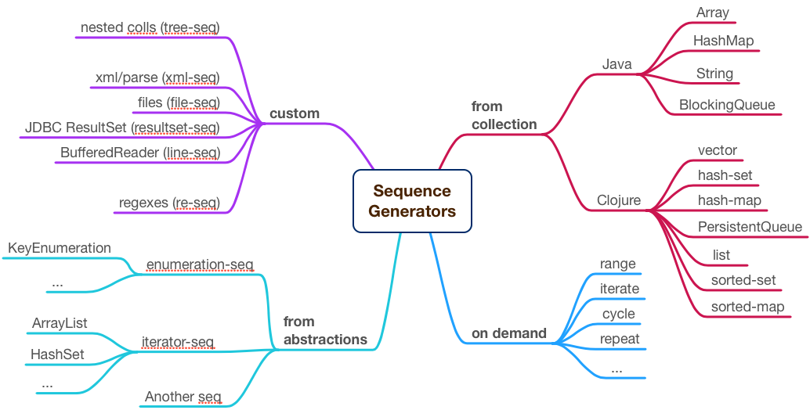

# 1. Lazy Sequences

# Laziness

```clojure

 (println "hi")  ;; evaluates immediately
 ;; hi

#(println "hi")  ;; needs invocation
;; #object[user$eval1843$fn__1844 0x9036860]

```
* Deferred code evaluation
* Code evaluates when requested

# Why do I care?

Performances and expressiveness:

* Consume data beyond memory capacity
* Avoid unnecessary evaluations
* Leverage caching
* Work with infinite sequences
* Detach producers/consumers

# How?

* Everything needs wrapping in `#()`
* Without language support it would look like:

```clojure

(defn lazy-list [coll]
  (map
    (fn [x]
      (fn [] (println "eval" x) x)) ;; need wrapping
    coll))

(def l (lazy-list [1 2 3]))

((first l)) ;; need invocation
;; eval 1
```

Clojure has that baked directly into Sequences

# Sequences

* Abstract Data Type (or ADT)
* Iterated sequentially (can't access Nth before Nth-1)
* Stateless cursor: no shared callers, only forward
* Commonly (not necessarily) lazy
* Persistent and immutable

# Generators options



# Some Examples

```clojure
;; No hanging
(def a (map inc (range 100000000000)))

;; Self referential
(def fibs
  (cons 0
    (cons 1
      (lazy-seq (map +' fibs (rest fibs))))))

;; Moving window memory load
(require '[clojure.java.io :refer [reader]])
(with-open [r (reader "/huge/petabytes/file")]
  (count (line-seq r)))
```

# Traps and gotchas

* Holding the head

```clojure
(let [res (map inc (range 1e7))] (first res) (last res))
;; 10000000
(let [res (map inc (range 1e7))] (last res) (first res))
;; Out of mem
```

* Chunkiness

```clojure
(first (map #(do (print ".") %) (range 1000)))
;; ................................0
```

# Taking control

* Create your own lazy sequence
* Optionally define chunkiness
* Your friends: `lazy-seq`, `cons`, `chunk-cons`

# Recursive Pattern


# Unchunk Example

* A lazy sequence generator using the pattern
* Apparently doing nothing, but it removes chunking:

```clojure
(defn unchunk [xs]
  (lazy-seq
    (when-first [x xs]
      (cons x (unchunk (rest xs))))))

(first (map #(do (print ".") %) (unchunk (range 1000))))
;; .0
```

# Chunked-Seq example

Read bytes from disk by block size (e.g. 4096):

```clojure
(import '[java.io FileInputStream InputStream])

(defn byte-seq [^InputStream is size]
  (let [ib (byte-array size)]
    ((fn step []
       (lazy-seq
         (let [n (.read is ib)]
           (when (not= -1 n)
             (let [cb (chunk-buffer size)]
               (dotimes [i size] (chunk-append cb (aget ib i)))
               (chunk-cons (chunk cb) (step))))))))))
```

# byte-seq how to use

```clojure
(with-open [fis (FileInputStream. "/usr/share/dict/words")]
  (let [bs (byte-seq fis 4096)]
    (String. (byte-array (take 20 bs)))))
;; "A\na\naa\naal\naalii\naam"
```

# Lab 01: lazy S3

* Create a lazy-seq out of S3 objects.
* Objects are fetched in batch of 1000 each.
* Goal: hide batching and produce a lazy sequence.
* Suggestions: `concat` them into next recursive request.
* Uncomment the fist test in lab01-test
* Run `clj -Atest` from `./labs` folder and make tests green.
