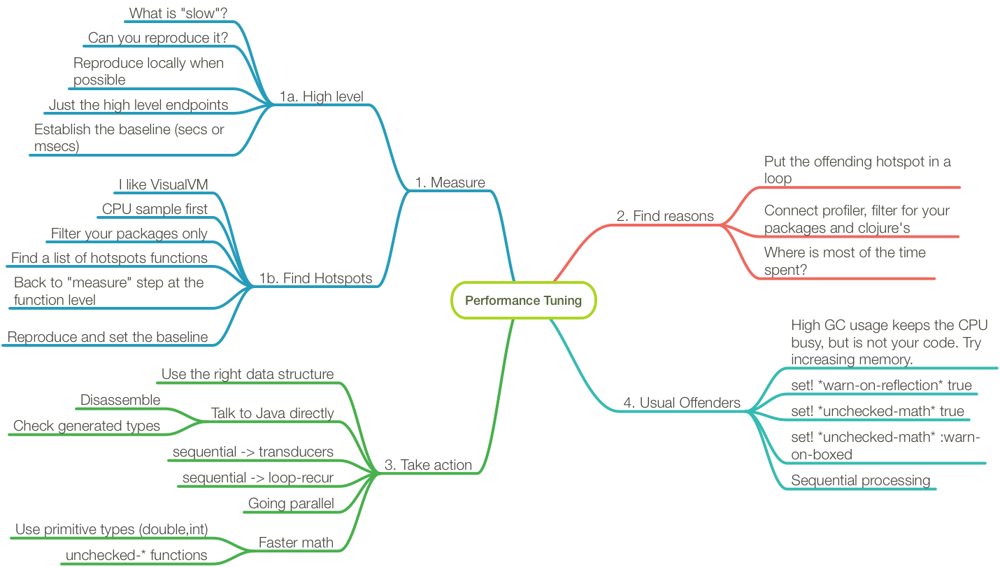

# ### 5. Performances



# High level baseline

* Isolate and replicate (possibly locally)
* Stub out network call (when possible)
* Measure deterministically: that's the baseline
* Not necessarily exact, but deterministic
* Usually "seconds" at high level

# Hotspots

* Pick a profiler, for example VisualVM
* CPU sample, filter your app packages
* Replicate hotspots in code
* Loop the hotspots if necessary
* Measure deterministically
* Usually ms, us, or even ns
* You need a profiler (e.g. Criterium)

# Type hinting

* Only useful if you have Java Interop
* Especially useful in tight loops
* Less useful at high level (e.g. `(.close conn)`)

```clojure
(import 'java.nio.charset.StandardCharsets)

(defn get-bytes [s] (.getBytes s (StandardCharsets/UTF_8)))

(get-bytes "clojure")
;; #object["[B" 0x5f254608 "[B@5f254608"]

(set! *warn-on-reflection* true)
(defn get-bytes [s] (.getBytes s (StandardCharsets/UTF_8)))

;; Reflection warning call to method getBytes can't be resolved
```

# Type hints impact

Usually 1 order of magnitude

```clojure
(require '[criterium.core :refer [quick-bench]])
(quick-bench (get-bytes "clojure"))
;; Execution time mean : 2.503821 µs
(defn get-bytes [^String s] (.getBytes s (StandardCharsets/UTF_8)))
(quick-bench (get-bytes "clojure"))
;; Execution time mean : 62.361678 ns
```

# What's going on

* We are going to use the `no.disassemble` library

```clojure
(require '[no.disassemble :refer [disassemble]])
(println (disassemble get-bytes))
```

* Search for `invokeStatic`
* `invoke` is used `when` get-bytes is high order

# Before type hints

```clojure
public static java.lang.Object invokeStatic(java.lang.Object s);
   3  ldc <String "getBytes"> [13]
   5  iconst_1
   6  anewarray java.lang.Object [15]
   9  dup
  10  iconst_0
  11  getstatic java.nio.charset.StandardCharsets.UTF_8
  14  aastore
  15  invokestatic clojure.lang.Reflector.invokeInstanceMethod
        (java.lang.Object, java.lang.String, java.lang.Object[])
```

# After type hinting

```clojure
public static java.lang.Object invokeStatic(java.lang.Object s);
   6  getstatic java.nio.charset.StandardCharsets.UTF_8
   9  checkcast java.nio.charset.Charset [21]
  12  invokevirtual java.lang.String.getBytes
        (java.nio.charset.Charset)
```

# Transducers

* Easy win for long chain of threaded macros
* Less win for shorter chain or trivial transforms
* Sometimes porting to transducers is not trivial

# Parallelism

* `pmap`
* `r/fold`
* `core.async` pipelines
* custom with `future` and `deref`

# Lab 05

* Pick a project you work on
* Better if not too big and easily runnable
* Connect VisualVM
* Find hotspots
* Easy fixes?
