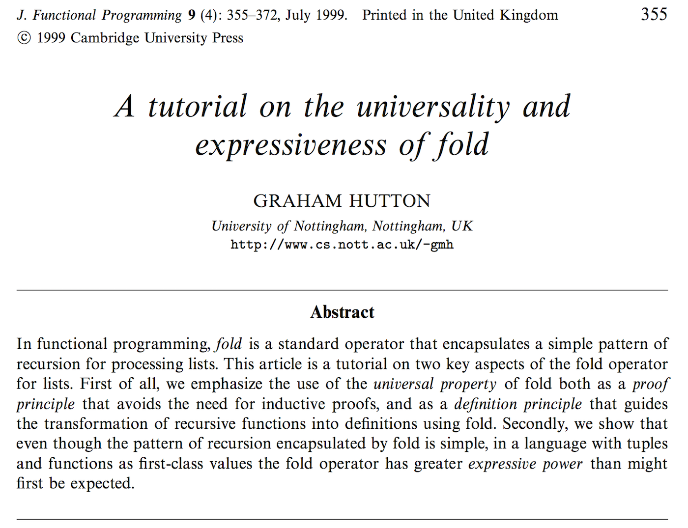

# ### 2. Custom Xforms



# `fold`

* The idea: redefine sequential operations as folds
* `fold` is a class of recursive-iterative algorithms
* Results are part of the args, no stack consumption
* Transform "f" also knows how to accumulate results
* `reduce` is fold-left: "folds" items from left to right
* Effects: isolate transforms and accumulation details

# core map/filter

```clojure
(defn map [f coll]
  (lazy-seq
    (when-let [s (seq coll)] ; terminating condition
      (cons
        (f (first s))        ; applying transform
        (map f (rest s)))))) ; non tail-recursive

(defn filter [pred coll]
  (lazy-seq
    (when-let [s (seq coll)]
      (let [f (first s) r (rest s)]
        (if (pred f)
          (cons f (filter pred r))
          (filter pred r))))))
```

# fold-left (`aka` reduce)

```clojure
(defn fold
 ([f coll]                  ; arity to setup an "init"
  (fold f [] coll))
 ([f result coll]

  (if coll
                  ; termination condition
   (recur                   ; tail recursive
    f                       ; "f" decides how to accumulate
    (f result (first coll)) ; transform applied here
    (next coll))            ; move on next element
  result)))                 ; return results when no more items
```

# Moving to fold

* Express `map`, `filter`, etc. as `fold`
* We need to move from linear recursive to iterative.
* We need "f" to gradually build results.
* We need an "init" result to start from.
* It can't be lazy (there is no seq building)

# step 1: shape-up

```clojure
(defn map [f result coll]
  (if coll
    (map f (f result (first coll)) (next coll))
    result))

;; Example: (map inc (range 10))
(map #(conj %1 (inc %2)) [] (range 10))

(defn filter [f result coll]
  (if coll
    (filter f (f result (first coll)) (next coll))
    result))

;; Example: (filter odd? (range 10))
(filter #(if (odd? %2) (conj %1 %2) %1) [] (range 10))
```

# step 2: rename

`map` and `filter` are the same! Rename to transform.

```clojure
(defn transform [f result coll]
  (if coll
    (transform f (f result (first coll)) (next coll))
    result))

;; Example: (map inc (range 10))
(transform #(conj %1 (inc %2)) [] (range 10))

;; Example: (filter odd? (range 10))
(transform #(if (odd? %2) (conj %1 %2) %1) [] (range 10))
```

# step 3: transform==reduce

`transform` **is** `reduce`!

```clojure
;; Example: (map inc (range 10))
(reduce #(conj %1 (inc %2)) [] (range 10))

;; Example: (filter odd? (range 10))
(reduce #(if (odd? %2) (conj %1 %2) %1) [] (range 10))
```

# step 4: anon to function

Let's extract those anons into fns.

```clojure
(defn mapping [result el]
  (conj result (inc el)))

;; Example: (map inc (range 10))
(reduce mapping [] (range 10))

(defn filtering [result el]
  (if (odd? el)
    (conj result el)
    result))

;; Example: (filter odd? (range 10))
(reduce filtering [] (range 10))
```

# step 5: Extract accumulation

`conj` is specific accumulation logic. Extract param.

```clojure
(defn mapping [rf]
  (fn [result el]
    (rf result (inc el))))

;; Example: (map inc (range 10))
(reduce (mapping conj) [] (range 10))

(defn filtering [rf]
  (fn [result el]
    (if (odd? el)
      (rf result el)
      result)))

;; Example: (filter odd? (range 10))
(reduce (filtering conj) [] (range 10))
```

# step 6: Extract transform

`inc` and `odd?` are specific transform logic. Extract param.

```clojure
(defn mapping [f]
  (fn [rf]
    (fn [result el]
      (rf result (f el)))))

;; Example: (map inc (range 10))
(reduce ((mapping inc) conj) [] (range 10))

(defn filtering [pred]
  (fn [rf]
    (fn [result el]
      (if (pred el) (rf result el) result))))

;; Example: (filter odd? (range 10))
(reduce ((filtering odd?) conj) [] (range 10))
```

# step 7: encapsulate call

`mapping` and `filtering` need preparation for use.
Extract that complexity away in new function `wrapper`
"init" can be obtained from `(rf)`

```clojure
(defn wrapper [xf rf coll]
  (reduce (xf rf) (rf) coll))

;; Example: (map inc (range 10))
(wrapper (mapping inc) conj (range 10))

;; Example: (filter odd? (range 10))
(wrapper (filtering odd?) conj (range 10))
```

# step 8: final touches

* We reached our desired form.
* Can you guess how "wrapper" was officially named?
* And what about "mapping" or "filtering"?
* What mapping/filtering have in common?

# Additional details

* `mapping`/`filtering` are very similar to map/filter
* Same for `wrapper` which was named `transduce`
* The stdlib also implements setup/tear-down behaviors
* This is why `map` and `filter` xform have more arities
* A "good transducer" also need to behave correctly

# Designing a transducer

* Deal with the end of the reduction in 1-arg arity
* Provide an initial value in 0-arg arity (currently unused)
* Where to initialize state (for stateful xforms)
* How to terminate early (if needed)
* Surrounding xforms awareness (mandatory calls)

# Resources

* A tutorial on the [universality and expressiveness of fold](www.cs.nott.ac.uk/~pszgmh/fold.pdf)
* uSwitch Labs [transducers articles](https://labs.uswitch.com/transducers-from-the-ground-up-the-essence/)

# Lab 02

* Task 1: create a "logging" transducer to print useful info.
* Task 2: create a stateful moving average transducer
* Open `src/transducers_workshop/lab02.clj` to get started
